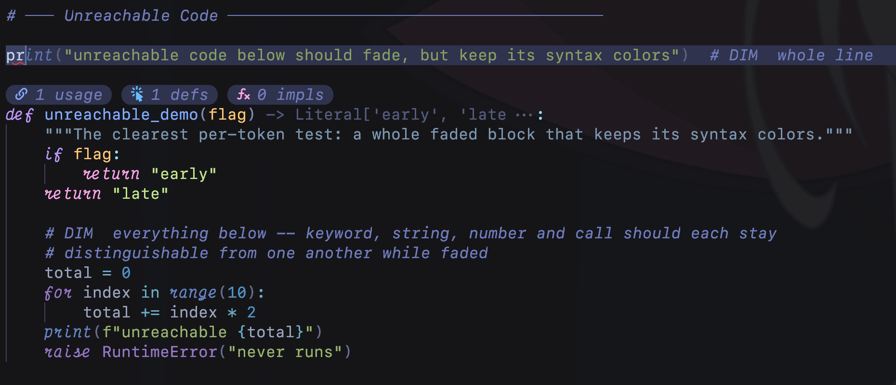

# fade.nvim

[](https://github.com/Fau818/fade.nvim/actions/workflows/test.yml)

Faded text that keeps its syntax colors.



Dead code and unaccepted completion previews are usually drawn in one flat gray, which throws away
everything the highlighting was telling you. **fade.nvim** mixes each token's own color toward the
background instead, so a faded keyword, string and number still read as a keyword, a string and a
number. Only `fg` is set, so bold and italic survive.

| | |
|---|---|
| `unused` | Fades code the LSP tags `unnecessary`, and hides its squiggle, sign and virtual text. |
| `ghost` | Syntax-colors the inline completion preview from **copilot.lua** and **blink.cmp**. |

The two are independent — turn one off and nothing of it is installed.

## Requirements

- Neovim **0.10+** for the `unnecessary` diagnostic tag, tested on 0.12
- A treesitter parser for the languages you want colored; without one, text falls back to a flat gray
- `ghost` needs [copilot.lua](https://github.com/zbirenbaum/copilot.lua) or
  [blink.cmp](https://github.com/Saghen/blink.cmp)

## Install

```lua
-- lazy.nvim
{
  "Fau818/fade.nvim",
  event = { "LspAttach", "InsertEnter" },  -- `unused` needs a server, `ghost` needs insert mode
  opts = {},

  dependencies = {
    { "zbirenbaum/copilot.lua", optional = true },
    { "Saghen/blink.cmp", optional = true },
  },
}
```

## Configuration

Defaults, all optional:

```lua
require("fade").setup({
  unused = {
    enabled      = true,
    alpha        = 0.75,  -- share of the original color kept; lower fades further
    min_contrast = 3.0,   -- below this WCAG ratio, a group keeps its own color instead of fading
    ignore       = {},    -- capture groups never faded, matched by prefix
    priority     = 200,   -- must outrank treesitter (100), semantic tokens (128), diagnostics (150)
    hide         = { underline = true, virtual_text = true, signs = true },  -- handlers to skip
    patterns     = {},    -- Lua patterns, for servers that report unused code without the tag
    exclude      = {},    -- filetypes to leave alone, e.g. { markdown = true }
  },
  ghost = {
    enabled      = true,
    alpha        = 0.65,  -- suggestions want to sit further back than real code
    min_contrast = 3.0,
    ignore       = { "@comment" },
    providers    = { copilot = true, blink = true },
  },
})
```

- **`alpha`** — how much color survives. `0.75` keeps 75% of the token's own color and mixes the rest
  into the background. Ghost text defaults lower, so it sits behind your real code.
- **`min_contrast`** — a floor, so nothing fades to unreadable. Quiet colors have less room than
  bright ones, so a color landing below this ratio keeps its original instead. `0` turns it off.
- **`ignore`** — capture groups that never fade, whatever the floor says.
- **`hide`** — which diagnostic handlers stop drawing unused code. `underline` is where Neovim paints
  its own flat gray, so hiding it is what hands the job to this plugin. The diagnostics themselves
  stay put, in `vim.diagnostic.get()`, the float and the location list.

`:h fade-config` covers `priority`, `patterns`, `exclude` and `providers`.

## Commands

```vim
:Fade toggle          " both features
:Fade toggle ghost    " one of them
:checkhealth fade     " when nothing is fading and you want to know why
```

Also available as `require("fade").toggle()`, `.enable()`, `.disable()`.

## How it works

One extmark carries one highlight group, which is why Neovim's own `DiagnosticUnnecessary` has to
flatten everything it covers. `unused` instead walks the treesitter captures inside each unused range
and sets one `fg`-only extmark per token. `ghost` has no captures to walk — virtual text is not
buffer content — so it parses the suggestion separately and rewrites the provider's extmark in the
same frame, before the flat color can appear. Full write-up in `:h fade-how-it-works`.

## Limitations

- `ghost` monkeypatches copilot's and blink's draw functions. Both calls are wrapped in `pcall`, so
  an upstream rename means ghost text quietly loses the effect rather than breaking.
  `:checkhealth fade` reports whether the hooks are still in place.

## Tests

```sh
make test               # everything
make test SPEC=ghost    # one spec file
```

Runs under `nvim -l` on a stock Neovim with no dependencies; CI covers 0.10, stable and nightly.
For a manual check, open `demo/unused.py` with an LSP attached.

## Credits

The `unused` feature covers the same ground as
[neodim](https://github.com/zbirenbaum/neodim), which came first and is where the idea of blending
towards the background rather than flattening to gray comes from.

Built with [Claude Code](https://claude.com/claude-code) (Claude Opus 5), which wrote the
implementation and these docs.

## License

MIT
