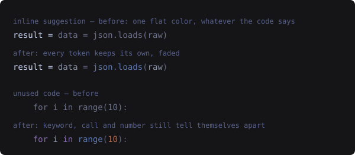

# fade.nvim

[](https://github.com/Fau818/fade.nvim/actions/workflows/test.yml)

Faded text that keeps its syntax colors.



Two things in your buffer aren't really code you're writing: the parts the language server says are
dead, and the completion preview you haven't accepted. Both are usually rendered in one flat gray,
which throws away everything the highlighting was telling you. **fade.nvim** mixes each token's own
color toward the background instead, so a faded keyword, string and number still read as a
keyword, a string and a number. Only `fg` is set, so bold and italic still come from whatever drew
the text underneath.

## Features

| | |
|---|---|
| `unused` | Fades code the LSP tags `unnecessary`, and hides its squiggle, sign and virtual text. |
| `ghost` | Syntax-colors the inline completion preview from **copilot.lua** and **blink.cmp**. |

Each is independent. Turn either off and nothing of it is installed — `ghost` in particular wraps
two other plugins' draw functions, and that never happens unless you ask for it.

## Requirements

- Neovim **0.10+** (`unnecessary` diagnostic tag), tested on 0.12
- A treesitter parser for the languages you want colored; without one, text falls back to a flat
  `DiagnosticUnnecessary`
- `ghost` additionally wants [copilot.lua](https://github.com/zbirenbaum/copilot.lua) or
  [blink.cmp](https://github.com/Saghen/blink.cmp)

## Install

```lua
-- lazy.nvim
{
  "Fau818/fade.nvim",
  event = { "LspAttach", "InsertEnter" },  -- `unused` needs a server, `ghost` needs insert mode
  opts = {},

  dependencies = {
    { "zbirenbaum/copilot.lua", optional = true },
    { "Saghen/blink.cmp", optional = true },
  },
}
```

## Configuration

Defaults, all optional:

```lua
require("fade").setup({
  unused = {
    enabled      = true,
    alpha        = 0.75,  -- share of the original color kept; lower fades further
    min_contrast = 3.0,   -- below this, a group keeps its own color instead of fading
    ignore       = {},    -- capture groups never faded, whatever the contrast
    priority     = 200,   -- must outrank treesitter (100), semantic tokens (128), diagnostics (150)
    hide         = { underline = true, virtual_text = true, signs = true },
    patterns     = {},    -- Lua patterns, for servers that report unused code without the tag
    exclude      = {},    -- filetypes to leave alone, e.g. { markdown = true }
  },
  ghost = {
    enabled      = true,
    alpha        = 0.65,  -- suggestions want to sit further back than real code
    min_contrast = 3.0,
    ignore       = { "@comment" },
    providers    = { copilot = true, blink = true },
  },
})
```

`hide` filters unused diagnostics out of those handlers. They stay in `vim.diagnostic.get()`, the
float and the location list — you just stop getting a squiggle under code that is merely unused. The
`underline` handler is also where Neovim applies its own flat `DiagnosticUnnecessary`, so hiding it
is what hands the fading over to this plugin.

### Keeping faded text readable

Fading takes a share of the color, but legibility is not a share of anything: the alpha that leaves
a keyword readable can push an already-quiet group into the background entirely — which is what a
suggestion **inside a comment block** runs into. Two settings guard against it.

`min_contrast` is the automatic net. The faded result is measured as a
[WCAG contrast ratio](https://www.w3.org/TR/WCAG21/#contrast-minimum), and anything landing below
the floor keeps its own color — skipped, never reversed, so faded text is never made louder than
the real text beside it. The default **3.0** is WCAG's threshold for large text and non-text UI; the
4.5 for body text is deliberately not the target, since a floor that high un-fades most of a palette
and amounts to turning the plugin off. Use `0` to fade unconditionally.

`ignore` is the explicit opt-out, matched by prefix, so `"@comment"` also covers
`@comment.documentation.python`. It answers a different question from the floor: `min_contrast` asks
*is this still legible*, `ignore` asks *should this fade at all*. At the default `alpha` the two
agree — a comment fading to 2.67 is already below 3.0 — but that agreement belongs to the default.
Raise `alpha` to 0.75 and the same comment clears the floor at 3.13, so the floor stops holding it
back while `ignore` still does. `unused` ignores nothing: dead code's comments are dead too.

## Commands

```vim
:Fade toggle          " both features
:Fade toggle ghost    " one of them
:Fade demo            " draw a sample suggestion at the cursor, to see the effect
```

`:Fade demo` writes nothing to the buffer and clears itself on the next cursor move. Toggle, then
run it again, to compare against the flat original. The sample is Python. Also available as
`require("fade").toggle()`, `.enable()`, `.disable()`.

`demo/unused.py` covers every case the `unused` feature handles — plain, dotted and aliased imports,
locals flagged by two servers at once, unused private definitions, and an unreachable block. Open it
with an LSP attached; each line is annotated with what should fade.

## How it works

Neovim already fades unused code: the `underline` diagnostic handler applies
`DiagnosticUnnecessary` at priority 150, above treesitter (100) and semantic tokens (128). What it
cannot do is keep each token's own color, because one extmark carries one highlight group. So
`unused` walks the treesitter captures **inside** the unused ranges — few and short — and sets one
`fg`-only extmark per token at priority 200, on `DiagnosticChanged` rather than every redraw.

Ghost text is harder, because treesitter never highlights virtual text: `virt_text` is not buffer
content, so there are no captures to find. But a chunk's highlight may be a **list**, and it merges
per field — `{ "@keyword.lua", faded }` takes the color from the faded group and the italic from
the real capture. So the suggestion is parsed on its own with `get_string_parser`, captures are
mapped onto chunk boundaries, and the provider's extmark is rewritten by id from inside a wrapper on
its draw function, in the same frame, so the flat color never appears.

Two details that are easy to get wrong:

- A suggestion is a **fragment**. Parsed alone, a trailing `")` is one unterminated string that
  swallows the bracket. Parsing `line_prefix .. suggestion` and dropping the prefix fixes it.
- A lone identifier is `@variable` whatever it really is. The completion item's `kind` knows better,
  so it names the group — matched against the chunk that *ends* the inserted text, since an
  auto-import makes the server send a qualified `os.pread` and only the tail gets shown.

## Limitations

- `ghost` monkeypatches `copilot.suggestion.update_preview` and blink's
  `ghost_text.draw_preview`. Both calls are `pcall`'d, so a rename upstream means ghost text
  quietly reverts to its plain color rather than breaking — but it does mean the effect can
  disappear after a provider update. `:checkhealth fade` reports whether the hooks are in place.
- blink recomputes its preview on every keystroke in insert mode. Results are cached per
  (language, prefix, text), but a very long suggestion still costs a parse the first time.
- Single-identifier completions have exactly one token, so there is nothing multi-colored to show.
  The effect is visible on snippets, calls with arguments, and Copilot's multi-line suggestions.

## Tests

```sh
make test               # everything
make test SPEC=ghost    # one spec file
```

No dependencies: the suite runs under `nvim -l` on a stock Neovim and uses only parsers Neovim ships
with, so there is nothing to install. CI runs it on 0.10, stable and nightly.

Three things to know before adding a case:

- **The provider hooks are not covered.** `hook_copilot` and `hook_blink` wrap functions inside
  plugins that aren't installed under test, so that path only ever runs in a real editor. It is also
  the part most likely to break on an upstream rename — check it with `:checkhealth fade`, which
  reports whether each hook is in place.
- **Parse the buffer.** `get_captures_at_pos` reads a parsed tree, and a scratch buffer with no
  active highlighter has none, so `unused` would silently fall back to its flat group. Use
  `helpers.buffer()`, which parses for you, and stick to `lua` — it has the richest bundled query.
- **Use the fixed palette.** `helpers.palette()` pins `Normal` and `Comment` to known colors. A
  contrast assertion means nothing against whichever scheme happens to be loaded, and the numbers in
  these docs are quoted from that palette.

## Credits

The `unused` feature covers the same ground as
[neodim](https://github.com/zbirenbaum/neodim), which came first and is where the idea of blending
towards the background rather than flattening to gray comes from.

Built with [Claude Code](https://claude.com/claude-code) (Claude Opus 5), which wrote the
implementation and these docs.

## License

MIT
